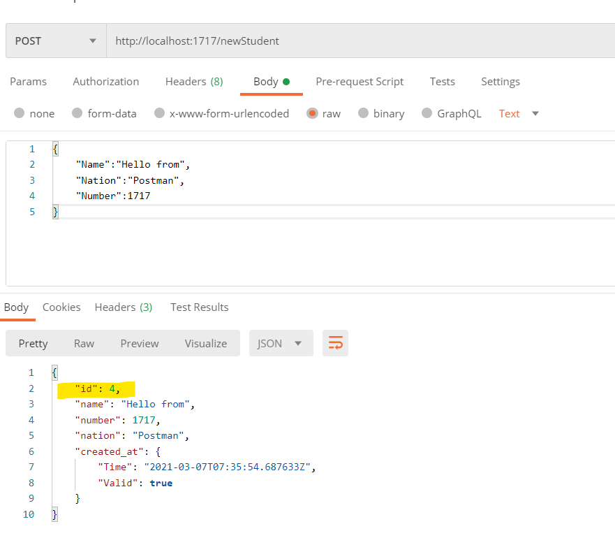
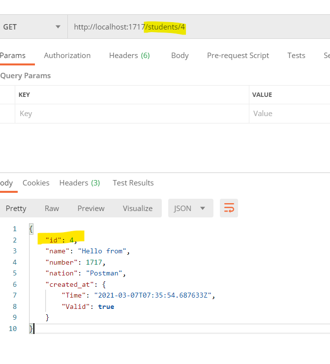
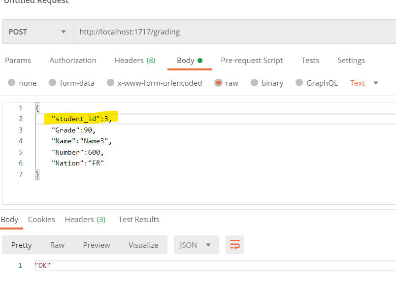

# Database Schema
+ [dbdiagram link](https://dbdiagram.io/d/6029516c80d742080a3a7643)


# PostgreSQL Image
```bash
docker pull postgres:12-alpine
```

# Run PostgreSQL Container
```bash
docker run --name postgres12 \
-e POSTGRES_USER=admin -e POSTGRES_PASSWORD=nimda -e POSTGRES_DB=automation \
-p 5432:5432 -d postgres:12-alpine
```

```bash
docker exec -it postgres12 psql -U admin
```


# GUI Tool for managing PostgreSQL
- [TablePlus link](https://tableplus.com/blog/2019/10/tableplus-linux-installation.html)

# sqlc for PostgreSQL interaction

- [sqlc](https://docs.sqlc.dev/en/latest/overview/install.html) &rarr; [download](https://dl.equinox.io/sqlc/sqlc/stable)
- [Example Usage](https://www.youtube.com/watch?v=uBPXNREhZZw)


# gomock for mocking PostgreSQL interaction
- [Instructions](https://dev.to/techschoolguru/mock-db-for-testing-http-api-in-go-and-achieve-100-coverage-4pa9)
- [Source](https://github.com/golang/mock)

# golang-migrate for schema creation/deletion

- [Source](https://github.com/golang-migrate/migrate/tree/master/cmd/migrate)
- [Installation](https://packagecloud.io/golang-migrate/migrate/)


# Gin as a web framework

- [Installation](https://github.com/gin-gonic/gin#installation)





# Viper for configuration management

- [Source](https://github.com/spf13/viper)
